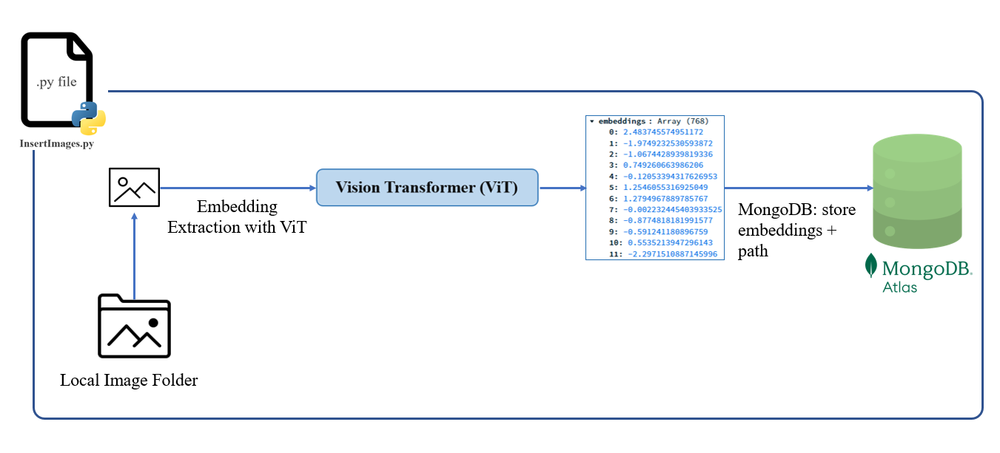
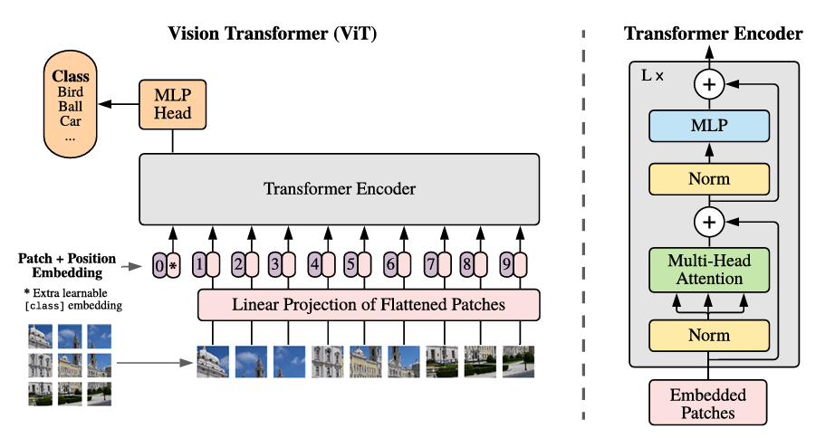
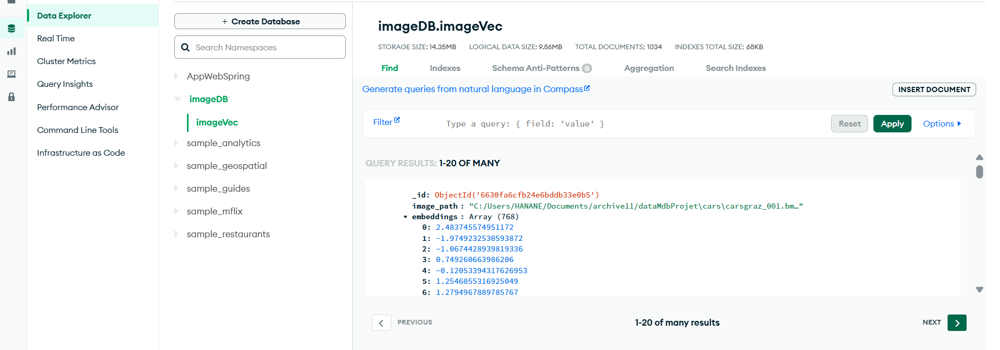
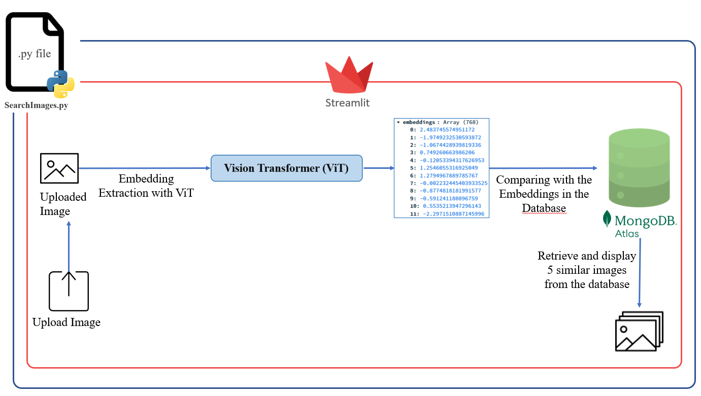
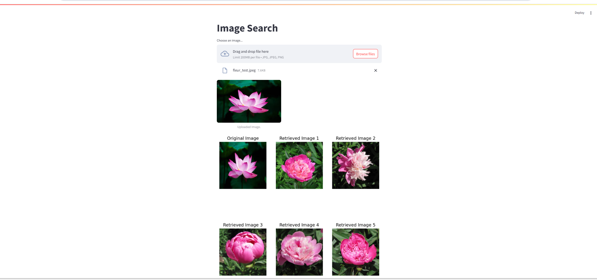

## Introduction

This project is intended for implementing **image similarity search** by combining **deep learning embeddings** with **MongoDB's vector search** capabilities.  

You will:  
- Generate embeddings for a dataset of images using Hugging Face’s **ViT (Vision Transformer)**.  
- Store these embeddings in a MongoDB Atlas (Cloud version of MongoDB) collection.  
- Create a Streamlit app that allows a user to upload an image and retrieve the top 5 most similar images from the database (MongoDB Atlas database).  

**Prerequisites:**  
- Basic Python knowledge.  
- Familiarity with MongoDB and installing Python libraries.  
- Python 3.8+ installed.  

---

## Step 1: Prepare the dataset and generate embeddings

In this step, you'll load a folder of images, generate their embeddings using ViT, and store them in MongoDB.

  

  *Figure 1: Architecture of the image insertion module showing how image embeddings are generated and stored in MongoDB.*


### 1.1 Install dependencies
```bash
pip install -r requirements.txt
```


### 1.2 Create account in MongoDB Atlas
Go to MongoDB Atlas website: https://www.mongodb.com/cloud/atlas/register, create an account, then create a project.
After that create a database and a collection.


### 1.3 Create a search index
To enable and accelerate image similarity searches, you need to create a **vector search index** in your MongoDB collection.

1. Open your MongoDB Atlas dashboard.
2. Go to **Clusters** and click **Browse Collections**.
3. Select your database and collection.
4. Navigate to the **Search Indexes** tab.
5. Click **Create Search Index**.
6. Choose **Vector Search** as the index type and set the field to `embeddings`.
7. Name the index (e.g., `p_similarity_search`) and save it.

```bash
{
  "mappings": {
    "dynamic": false,
    "fields": {
      "embeddings": {
        "dimensions": 768,
        "similarity": "cosine",
        "type": "knnVector"
      }
    }
  }
}
```


### 1.4 Overviw of ViT (Vision Tronsformer) model
Vision Transformer (ViT) is a transformer adapted for computer vision tasks. An image is split into smaller fixed-sized patches which are treated as a sequence of tokens, similar to words for NLP tasks. ViT requires less resources to pretrain compared to convolutional architectures and its performance on large datasets can be transferred to smaller downstream tasks.



  *Figure 2: Vision Transformer (ViT) architecture.*

For more informations, visit the huggingface documentation : https://huggingface.co/docs/transformers/model_doc/vit


### 1.5 Run the module to insert images
```bash
python InsertImages.py
```
After running the script, check MongoDB Atlas. You should see something like this:



  *Figure 3: Created database and filled collection in MongoDB Atlas.*


## Step 2: Search for similar images in the database

In this step, you will upload a new image via a Streamlit application to retrieve similar images from the database.



  *Figure 4: Database image search module architecture.*


### 2.1 Connect to your MongoDB Atlas account and allow access

After logging in to your account, go to the **Security > Network Access** section.  
Click the **ADD IP ADDRESS** button and enter your local IP address to allow access from your local machine to the MongoDB Atlas database when running the Python module.


  *Figure 5: Allowing access to MongoDB Atlas from the local machine.*


### 2.2 Run the module for searching images
```bash
streamlit run SearchImages.py
```


  *Figure 6: Output displayed after running the image insertion module.*


